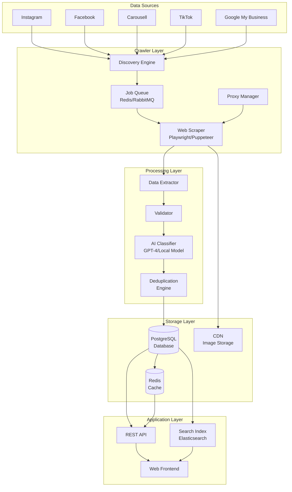
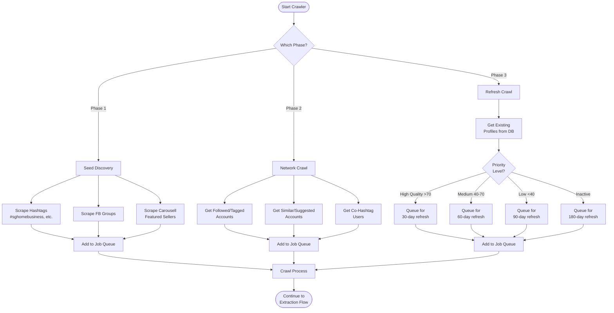
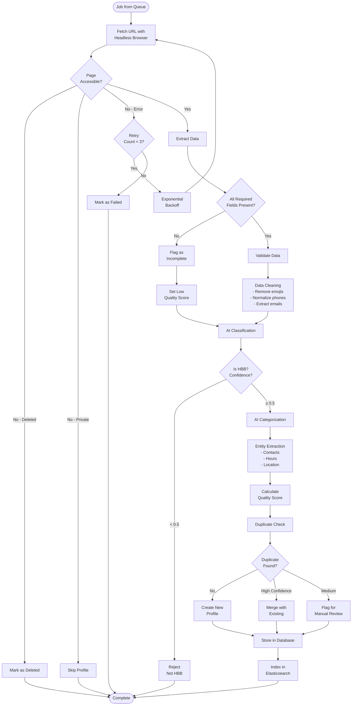
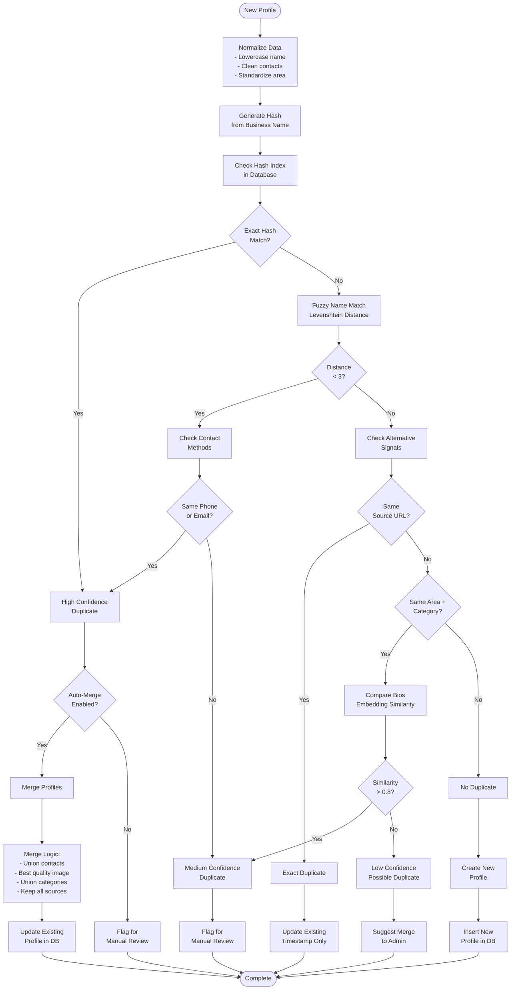
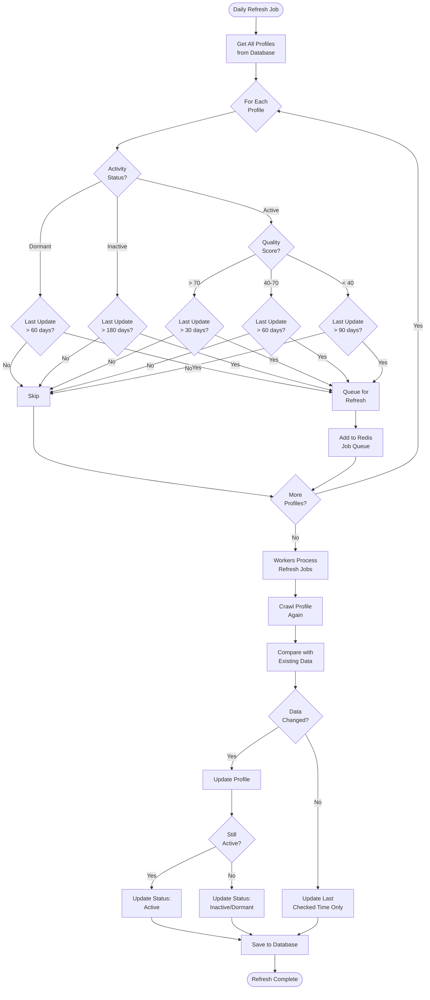
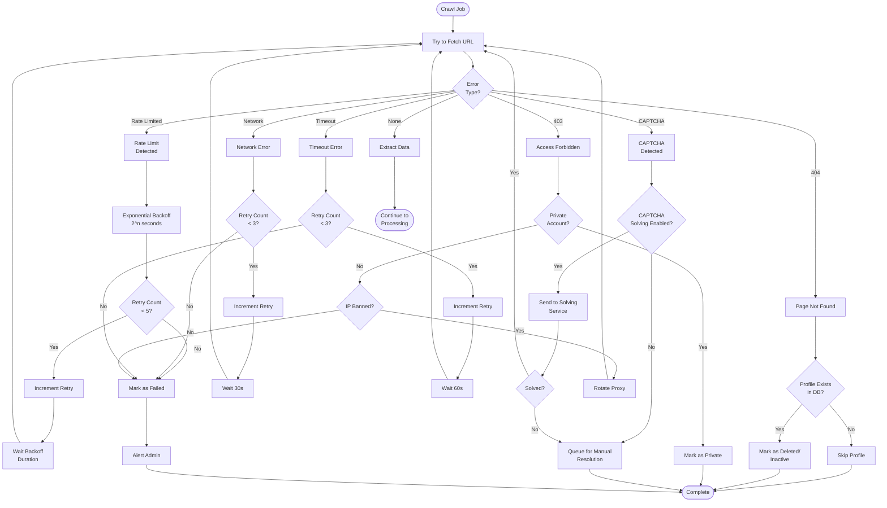

# HBB Crawler System - Workflow Diagrams

**Created**: 2026-01-26
**Last Updated**: 2026-01-26
**Related**: [HBB Crawler System PRD](../prds/hbb-crawler-system.md)

This document contains visual workflow diagrams for the HBB Crawler System architecture and data flows.

---

## 1. High-Level System Architecture



---

## 2. Crawler Discovery & Crawl Flow



---

## 3. Data Extraction & Processing Flow



---

## 4. AI Classification Workflow

```mermaid
flowchart TD
    START([Profile Data]) --> PREP[Prepare AI Prompt]
    
    PREP --> BIOTEXT{Has Bio<br/>Text?}
    BIOTEXT -->|Yes| ADDBIO[Add Bio to Prompt]
    BIOTEXT -->|No| SKIPBIO[Skip Bio]
    
    ADDBIO --> HASHTAGS{Has<br/>Hashtags?}
    SKIPBIO --> HASHTAGS
    
    HASHTAGS -->|Yes| ADDHASH[Add Hashtags<br/>to Prompt]
    HASHTAGS -->|No| SKIPHASH[Skip Hashtags]
    
    ADDHASH --> LOCATION{Has<br/>Location?}
    SKIPHASH --> LOCATION
    
    LOCATION -->|Yes| ADDLOC[Add Location<br/>to Prompt]
    LOCATION -->|No| SKIPLOC[Skip Location]
    
    ADDLOC --> CALLAI[Call AI API<br/>GPT-4]
    SKIPLOC --> CALLAI
    
    CALLAI --> PARSE[Parse JSON<br/>Response]
    
    PARSE --> VALID{Valid<br/>Response?}
    VALID -->|No| RETRY{Retry<br/>< 3?}
    VALID -->|Yes| EXTRACT[Extract Results]
    
    RETRY -->|Yes| CALLAI
    RETRY -->|No| FALLBACK[Use Rule-Based<br/>Fallback]
    
    EXTRACT --> CONFIDENCE[Get Confidence<br/>Score]
    FALLBACK --> CONFIDENCE
    
    CONFIDENCE --> THRESHOLD{Score<br/>≥ 0.5?}
    
    THRESHOLD -->|No| REJECTHBB[Reject as<br/>Non-HBB]
    THRESHOLD -->|Yes| CATEGORIZE[Categorize<br/>Business]
    
    CATEGORIZE --> CALLCAT[Call AI for<br/>Category Classification]
    CALLCAT --> PARSCAT[Parse Category<br/>Response]
    
    PARSCAT --> ENTITYEXT[Entity Extraction<br/>for Contacts/Hours]
    ENTITYEXT --> CALLENT[Call AI for<br/>Entity Extraction]
    CALLENT --> PARSEENT[Parse Extracted<br/>Entities]
    
    PARSEENT --> STORE[Store AI Results<br/>with Profile]
    REJECTHBB --> STORE
    
    STORE --> END([Return to<br/>Main Flow])
```



---

## 5. Duplicate Detection & Merging Flow



---

## 6. Profile Claiming Workflow

```mermaid
flowchart TD
    START([User Finds<br/>Their Profile]) --> CLICKCLAIM[Click "Claim<br/>This Business"]
    
    CLICKCLAIM --> METHOD{Verification<br/>Method?}
    
    METHOD -->|Instagram| IGVERIFY[Instagram<br/>Verification]
    METHOD -->|Phone| PHONEVERIFY[Phone OTP<br/>Verification]
    METHOD -->|Email| EMAILVERIFY[Email<br/>Verification]
    
    IGVERIFY --> IGDM[Send DM to<br/>Instagram Account<br/>with Code]
    IGDM --> IGWAIT[Wait for User<br/>to Enter Code]
    IGWAIT --> IGCHECK{Code<br/>Correct?}
    IGCHECK -->|No| IGFAIL[Verification Failed]
    IGCHECK -->|Yes| VERIFIED[Profile Verified]
    
    PHONEVERIFY --> SENDOTP[Send OTP to<br/>Phone Number]
    SENDOTP --> PHONEWAIT[Wait for User<br/>to Enter OTP]
    PHONEWAIT --> PHONECHECK{OTP<br/>Correct?}
    PHONECHECK -->|No| PHONEFAIL[Verification Failed]
    PHONECHECK -->|Yes| VERIFIED
    
    EMAILVERIFY --> SENDEMAIL[Send Verification<br/>Link to Email]
    SENDEMAIL --> EMAILWAIT[Wait for User<br/>to Click Link]
    EMAILWAIT --> EMAILCHECK{Link<br/>Clicked?}
    EMAILCHECK -->|No| EMAILFAIL[Verification Failed]
    EMAILCHECK -->|Yes| VERIFIED
    
    VERIFIED --> CREATEACCT[Create User<br/>Account]
    CREATEACCT --> LINKPROFILE[Link Account<br/>to Profile]
    LINKPROFILE --> GRANTACCESS[Grant Edit<br/>Permissions]
    
    GRANTACCESS --> ADDBADGE[Add "Verified"<br/>Badge to Profile]
    ADDBADGE --> NOTIFY[Notify User<br/>of Success]
    
    NOTIFY --> EDITFORM[Show Enhanced<br/>Edit Form]
    EDITFORM --> USERUPDATE[User Updates<br/>Profile Info]
    USERUPDATE --> SAVEDB[Save to Database]
    SAVEDB --> REINDEX[Reindex in<br/>Search Engine]
    
    REINDEX --> COMPLETE([Profile Claimed<br/>& Updated])
    
    IGFAIL --> RETRY{Retry<br/>Allowed?}
    PHONEFAIL --> RETRY
    EMAILFAIL --> RETRY
    
    RETRY -->|Yes| METHOD
    RETRY -->|No| FAILED([Claiming Failed])
```

---

## 7. Refresh Strategy Flow



---

## 8. Error Handling & Retry Flow



---

## 9. Data Quality Scoring Flow

```mermaid
flowchart TD
    START([Profile Data]) --> INITSCORE[Initialize Score = 0]
    
    INITSCORE --> CHECKDP{Has Display<br/>Picture?}
    CHECKDP -->|Yes| ADDDP[Score + 20]
    CHECKDP -->|No| SKIPDP[Skip]
    
    ADDDP --> CHECKDESC{Has<br/>Description?}
    SKIPDP --> CHECKDESC
    
    CHECKDESC -->|Yes| ADDDESC[Score + 15]
    CHECKDESC -->|No| SKIPDESC[Skip]
    
    ADDDESC --> CHECKCONTACT{Has 2+<br/>Contacts?}
    SKIPDESC --> CHECKCONTACT
    
    CHECKCONTACT -->|Yes| ADDCONTACT[Score + 15]
    CHECKCONTACT -->|No| SKIPCONTACT[Skip]
    
    ADDCONTACT --> CHECKAREA{Has Area/<br/>Location?}
    SKIPCONTACT --> CHECKAREA
    
    CHECKAREA -->|Yes| ADDAREA[Score + 10]
    CHECKAREA -->|No| SKIPAREA[Skip]
    
    ADDAREA --> CHECKHOURS{Has Operating<br/>Hours?}
    SKIPAREA --> CHECKHOURS
    
    CHECKHOURS -->|Yes| ADDHOURS[Score + 10]
    CHECKHOURS -->|No| SKIPHOURS[Skip]
    
    ADDHOURS --> CHECKIMAGES{Has 3+<br/>Images?}
    SKIPHOURS --> CHECKIMAGES
    
    CHECKIMAGES -->|Yes| ADDIMAGES[Score + 10]
    CHECKIMAGES -->|No| SKIPIMAGES[Skip]
    
    ADDIMAGES --> CHECKPRICE{Has Price<br/>Range?}
    SKIPIMAGES --> CHECKPRICE
    
    CHECKPRICE -->|Yes| ADDPRICE[Score + 10]
    CHECKPRICE -->|No| SKIPPRICE[Skip]
    
    ADDPRICE --> CHECKSOCIAL{Has Social<br/>Metrics?}
    SKIPPRICE --> CHECKSOCIAL
    
    CHECKSOCIAL -->|Yes| ADDSOCIAL[Score + 5]
    CHECKSOCIAL -->|No| SKIPSOCIAL[Skip]
    
    ADDSOCIAL --> CHECKREVIEWS{Has<br/>Reviews?}
    SKIPSOCIAL --> CHECKREVIEWS
    
    CHECKREVIEWS -->|Yes| ADDREVIEWS[Score + 5]
    CHECKREVIEWS -->|No| SKIPREVIEWS[Skip]
    
    ADDREVIEWS --> FINALSCORE[Final Quality<br/>Score: 0-100]
    SKIPREVIEWS --> FINALSCORE
    
    FINALSCORE --> CLASSIFY{Score<br/>Range?}
    
    CLASSIFY -->|> 70| HIGH[High Quality<br/>Profile]
    CLASSIFY -->|40-70| MEDIUM[Medium Quality<br/>Profile]
    CLASSIFY -->|< 40| LOW[Low Quality<br/>Profile]
    
    HIGH --> SAVESTATUS[Save Quality<br/>Status to DB]
    MEDIUM --> SAVESTATUS
    LOW --> SAVESTATUS
    
    SAVESTATUS --> END([Complete])
```



---

## 10. Complete End-to-End Flow

```mermaid
flowchart LR
    subgraph "Discovery"
        A[Hashtag Search]
        B[FB Group Scrape]
        C[Network Crawl]
    end
    
    subgraph "Queue"
        Q[Redis Job Queue]
    end
    
    subgraph "Crawling"
        D[Fetch with Browser]
        E[Extract Data]
        F[Validate Fields]
    end
    
    subgraph "AI Processing"
        G[HBB Classification]
        H[Category Classification]
        I[Entity Extraction]
    end
    
    subgraph "Quality Control"
        J[Quality Scoring]
        K[Duplicate Check]
        L[Data Cleaning]
    end
    
    subgraph "Storage"
        M[(Database)]
        N[Search Index]
        O[CDN Images]
    end
    
    subgraph "Application"
        P[API]
        R[Web App]
        S[User Claims Profile]
    end
    
    A --> Q
    B --> Q
    C --> Q
    
    Q --> D
    D --> E
    E --> F
    
    F --> G
    G --> H
    H --> I
    
    I --> J
    J --> K
    K --> L
    
    L --> M
    M --> N
    E --> O
    
    M --> P
    N --> P
    P --> R
    R --> S
    S --> M
```



---

## Notes on Diagram Usage

### Mermaid Rendering
These diagrams use Mermaid syntax and will render automatically on:
- GitHub (native support)
- GitLab (native support)
- Visual Studio Code (with Mermaid extension)
- Many documentation platforms

### Diagram Purposes

1. **High-Level Architecture**: System overview for stakeholders
2. **Discovery & Crawl Flow**: For understanding crawler phases
3. **Extraction & Processing**: For developers implementing the pipeline
4. **AI Classification**: For AI integration and prompt engineering
5. **Duplicate Detection**: For data quality team
6. **Profile Claiming**: For product/UX team
7. **Refresh Strategy**: For operations team
8. **Error Handling**: For reliability engineering
9. **Quality Scoring**: For data quality metrics
10. **End-to-End Flow**: Quick reference for entire system

### Updating Diagrams

When system design changes:
1. Update relevant diagram(s)
2. Update "Last Updated" date at top
3. Add note in commit message about diagram changes
4. Ensure consistency across related diagrams

---

**Last Updated**: 2026-01-26
**Maintained By**: Engineering Team
**Related Documents**:
- [HBB Crawler System PRD](../prds/hbb-crawler-system.md)
- [HBB Directory Landscape Research](../research/hbb-directory-landscape-research.md)
