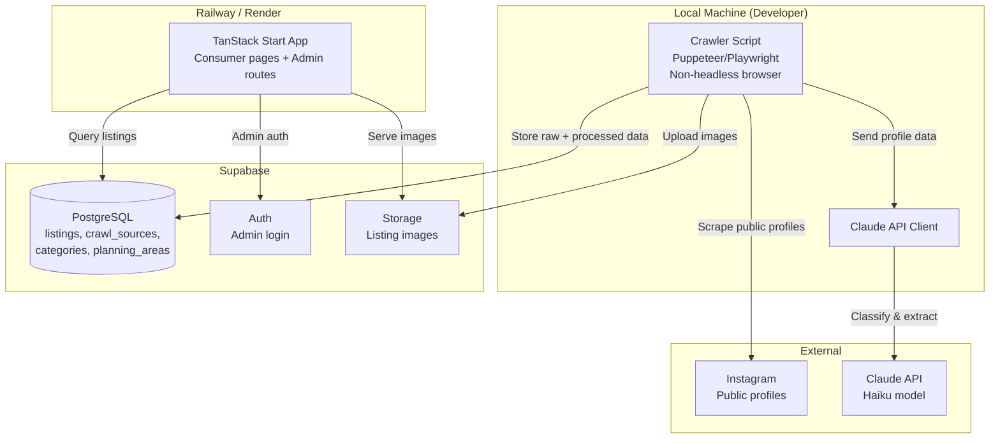
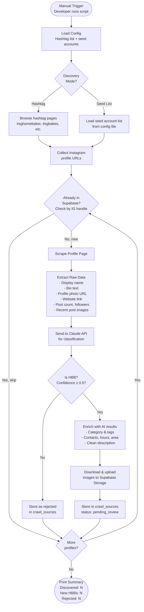
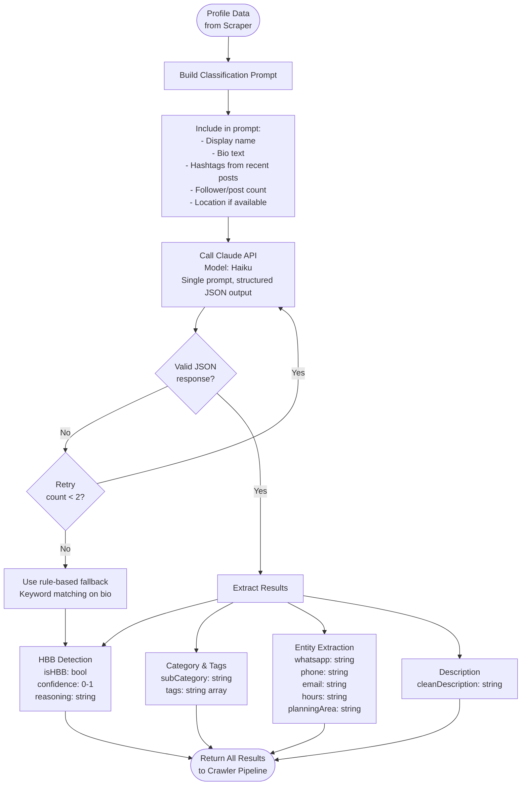
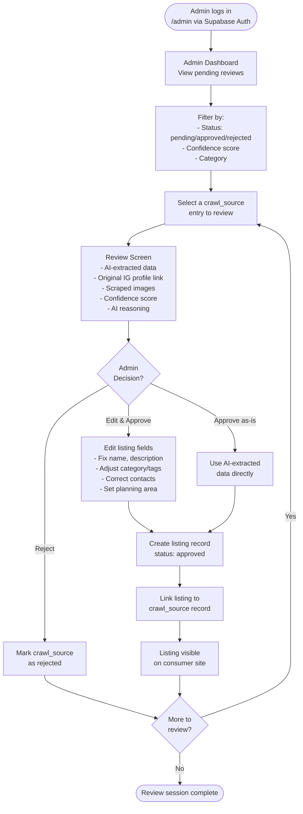
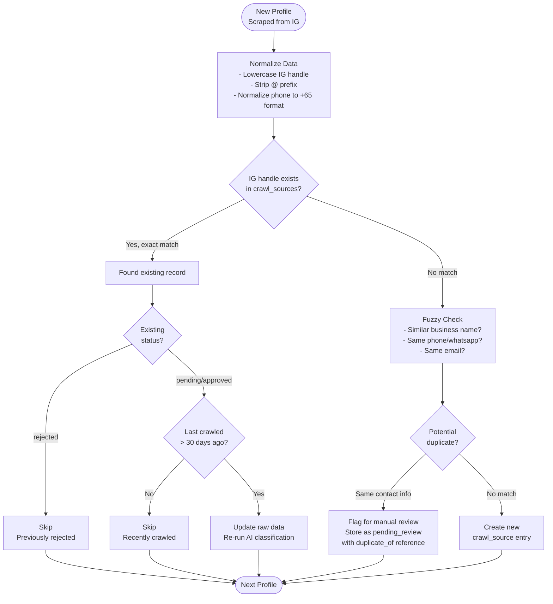
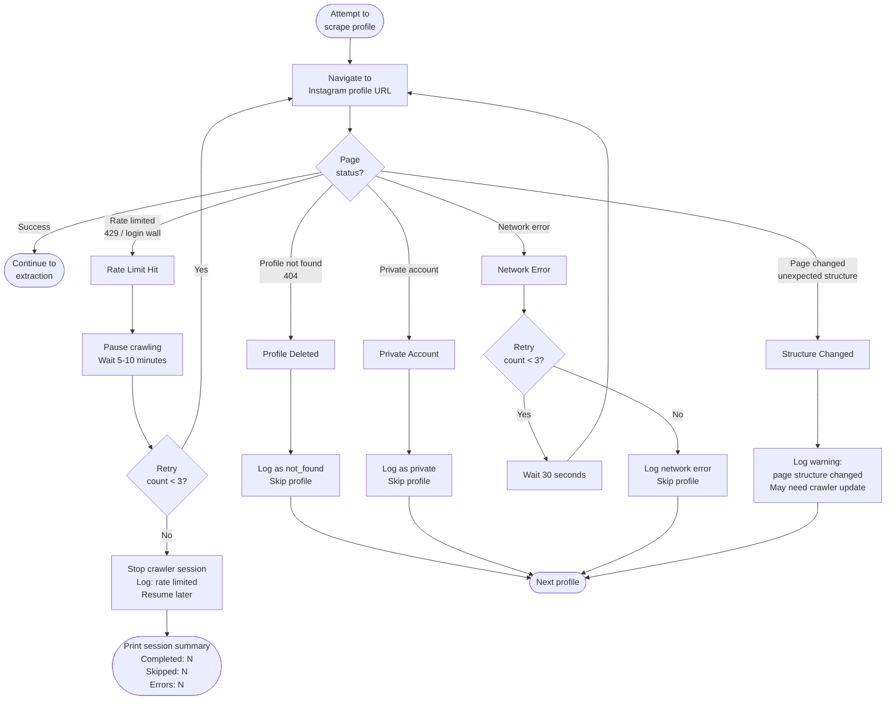
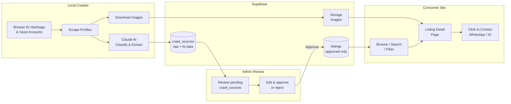

# MVP Crawler System - Workflow Diagrams

**Created**: 2026-03-09
**Last Updated**: 2026-03-09
**Related**: [MVP PRD](../prds/mvp-hbb-directory.md) | [ADR-002](../decisions/ADR-002-mvp-tech-architecture.md)

This document contains workflow diagrams for the MVP crawler system. The MVP crawler is a locally-run Puppeteer/Playwright script that scrapes Instagram, classifies profiles via Claude API, and stores results in Supabase.

---

## 1. High-Level System Architecture



---

## 2. Crawler Pipeline Flow

The end-to-end flow from discovery to storage.



---

## 3. AI Classification Workflow

How Claude API processes each scraped profile.



**Single-prompt approach**: All four tasks (HBB detection, categorization, entity extraction, description generation) are handled in one Claude API call to minimize cost and latency. The prompt requests a single structured JSON response containing all fields.

**Example prompt structure**:
```
Analyze this Instagram profile and determine if it's a Singapore home-based food business.

Profile:
- Name: {name}
- Bio: {bio}
- Hashtags: {hashtags}
- Followers: {followers}
- Posts: {post_count}

Return JSON with:
1. isHBB (bool), confidence (0-1), reasoning
2. foodSubCategory (from: cakes, cookies, meals, snacks, desserts, beverages, dietary-specific)
3. tags (relevant keywords)
4. contacts (whatsapp, phone, email extracted from bio)
5. operatingHours (if mentioned)
6. planningArea (Singapore area if mentioned)
7. cleanDescription (2-3 sentence business description)
```

---

## 4. Admin Review & Approval Flow

How admins review crawler results and publish listings.



---

## 5. Duplicate Detection Flow

How the crawler avoids creating duplicate entries.



---

## 6. Data Quality Scoring Flow

How each crawled profile gets a quality/completeness score.

```mermaid
flowchart TD
    START([Profile Data<br/>After AI Processing]) --> INIT[Initialize Score = 0]

    INIT --> CHECK_NAME{Has business<br/>name?}
    CHECK_NAME -->|Yes| ADD_NAME[Score + 10]
    CHECK_NAME -->|No| SKIP_NAME[Skip]

    ADD_NAME --> CHECK_DESC
    SKIP_NAME --> CHECK_DESC

    CHECK_DESC{Has clean<br/>description?}
    CHECK_DESC -->|Yes| ADD_DESC[Score + 15]
    CHECK_DESC -->|No| SKIP_DESC[Skip]

    ADD_DESC --> CHECK_PHOTO
    SKIP_DESC --> CHECK_PHOTO

    CHECK_PHOTO{Has profile<br/>photo?}
    CHECK_PHOTO -->|Yes| ADD_PHOTO[Score + 15]
    CHECK_PHOTO -->|No| SKIP_PHOTO[Skip]

    ADD_PHOTO --> CHECK_CONTACT
    SKIP_PHOTO --> CHECK_CONTACT

    CHECK_CONTACT{Has 1+<br/>contact method?}
    CHECK_CONTACT -->|Yes| ADD_CONTACT[Score + 15]
    CHECK_CONTACT -->|No| SKIP_CONTACT[Skip]

    ADD_CONTACT --> CHECK_MULTI
    SKIP_CONTACT --> CHECK_CATEGORY

    CHECK_MULTI{Has 2+<br/>contact methods?}
    CHECK_MULTI -->|Yes| ADD_MULTI[Score + 5]
    CHECK_MULTI -->|No| SKIP_MULTI[Skip]

    ADD_MULTI --> CHECK_CATEGORY
    SKIP_MULTI --> CHECK_CATEGORY

    CHECK_CATEGORY{Has food<br/>sub-category?}
    CHECK_CATEGORY -->|Yes| ADD_CAT[Score + 10]
    CHECK_CATEGORY -->|No| SKIP_CAT[Skip]

    ADD_CAT --> CHECK_AREA
    SKIP_CAT --> CHECK_AREA

    CHECK_AREA{Has planning<br/>area?}
    CHECK_AREA -->|Yes| ADD_AREA[Score + 10]
    CHECK_AREA -->|No| SKIP_AREA[Skip]

    ADD_AREA --> CHECK_IMAGES
    SKIP_AREA --> CHECK_IMAGES

    CHECK_IMAGES{Has 2+<br/>post images?}
    CHECK_IMAGES -->|Yes| ADD_IMG[Score + 10]
    CHECK_IMAGES -->|No| SKIP_IMG[Skip]

    ADD_IMG --> CHECK_HOURS
    SKIP_IMG --> CHECK_HOURS

    CHECK_HOURS{Has operating<br/>hours?}
    CHECK_HOURS -->|Yes| ADD_HOURS[Score + 10]
    CHECK_HOURS -->|No| SKIP_HOURS[Skip]

    ADD_HOURS --> FINAL
    SKIP_HOURS --> FINAL

    FINAL[Final Score: 0-100] --> CLASSIFY{Score<br/>range?}

    CLASSIFY -->|≥ 70| HIGH[High Quality<br/>Priority review]
    CLASSIFY -->|40-69| MEDIUM[Medium Quality<br/>Standard review]
    CLASSIFY -->|< 40| LOW[Low Quality<br/>May need manual enrichment]

    HIGH --> STORE[Store quality score<br/>with crawl_source]
    MEDIUM --> STORE
    LOW --> STORE
```



**Scoring breakdown (100 points total)**:

| Component | Points | Rationale |
|-----------|--------|-----------|
| Business name | 10 | Basic identifier |
| Clean description | 15 | Critical for listing page |
| Profile photo | 15 | Visual trust signal |
| 1+ contact method | 15 | Core CTA requirement |
| 2+ contact methods | 5 | Bonus for multiple channels |
| Food sub-category | 10 | Enables filtering |
| Planning area | 10 | Enables location filtering |
| 2+ post images | 10 | Visual product showcase |
| Operating hours | 10 | Useful but often missing |

---

## 7. Error Handling Flow

How the crawler handles common failure scenarios.



**Key error handling principles**:
- **Graceful degradation**: Skip problematic profiles, don't crash the whole run
- **Rate limit respect**: Pause and retry, stop the session if repeatedly limited
- **Visibility**: Log all errors with context for debugging
- **No proxy complexity**: Since we run locally with a visible browser, rate limits are handled by pausing rather than rotating proxies

---

## 8. End-to-End Data Flow

Complete flow from Instagram to consumer-facing listing.



---

## Notes

### Diagram Rendering
These diagrams use Mermaid syntax and render on GitHub, GitLab, VS Code (with Mermaid extension), and most documentation platforms.

### Key Differences from Archived Diagrams
| Archived (Full Vision) | MVP |
|---|---|
| Multi-platform (IG, FB, Carousell, TikTok) | Instagram only |
| Redis/RabbitMQ job queue | Simple sequential script |
| Elasticsearch search index | Supabase Postgres full-text search |
| Deployed crawler service | Local, manually triggered |
| Proxy rotation + CAPTCHA solving | No proxies, pause on rate limit |
| CDN for images | Supabase Storage |
| Profile claiming workflow | Not in MVP |
| Multiple AI calls per profile | Single Claude API call per profile |

### Updating These Diagrams
When the crawler design changes:
1. Update the relevant diagram(s)
2. Update "Last Updated" date at top
3. Ensure consistency with [MVP PRD](../prds/mvp-hbb-directory.md) and [ADR-002](../decisions/ADR-002-mvp-tech-architecture.md)
